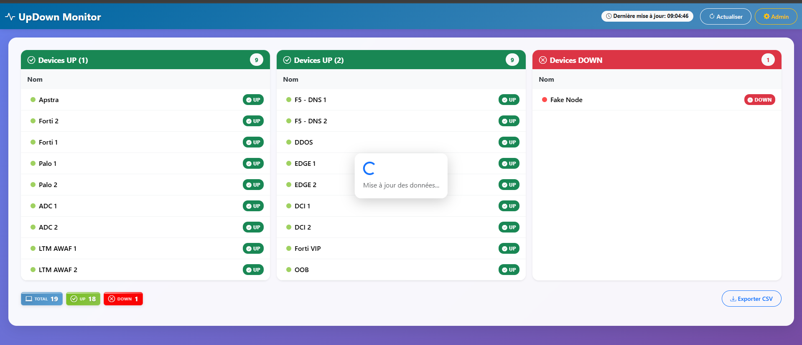

🚦 UpDown Monitor

UpDown Monitor est un outil simple et efficace de supervision réseau qui permet de surveiller en temps réel l’état des équipements et serveurs.

L’application effectue des pings réguliers vers les adresses IP configurées et affiche les résultats sur un dashboard clair et dynamique.

✨ Fonctionnalités

    📊 Dashboard visuel avec interfaces colorées :

    🟢 UP → l’équipement répond au ping

    🔴 DOWN → aucune réponse (hors ligne)

    🔄 Rafraîchissement automatique : suivi en direct de l’évolution des statuts.

    📋 Liste configurable d’équipements/serveurs à surveiller.

    ⚡ Léger et facile à déployer : pas de dépendances lourdes.

🛠️ Technologies utilisées

    - Django → backend et gestion des modèles.

    - Bootstrap → interface web responsive et intuitive.

    - Python (subprocess) → exécution des pings système.

🚀 Installation
    1. Cloner le projet
        git clone https://github.com/ton-compte/updown-monitor.git
        cd updown-monitor

    2. Créer un environnement virtuel et installer les dépendances: python -m venv venv

        - source venv/bin/activate   # Linux/macOS
        - venv\Scripts\activate      # Windows

        - pip install -r requirements.txt

    3. Lancer le serveur Django
        - python manage.py migrate
        - python manage.py runserver

Accéder ensuite à l’application :
👉 http://localhost:8000

🐳 Déploiement avec Docker
    1. Construire l’image
        docker build -t updown-monitor .

    2. Lancer le conteneur
        docker run -p 8000:8000 updown-monitor

L’application sera disponible sur :
👉 http://localhost:8000

📸 Aperçu du Dashboard

Voici l’interface principale d’UpDown Monitor :

📌 Roadmap / Améliorations possibles

    - Support d’autres méthodes de supervision (TCP check, HTTP check).

    - Export des résultats (CSV/JSON).

    - Authentification et gestion des utilisateurs.

📄 Licence

Projet open-source sous licence MIT.
Libre à vous de l’utiliser, le modifier et le partager.